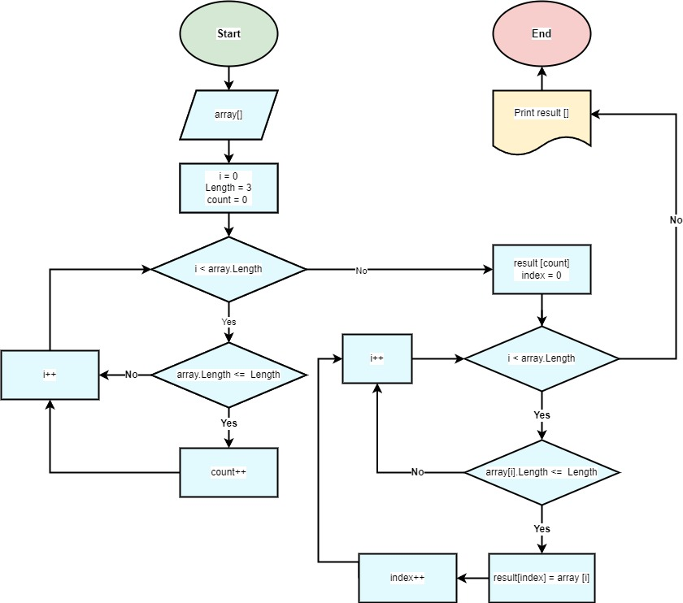
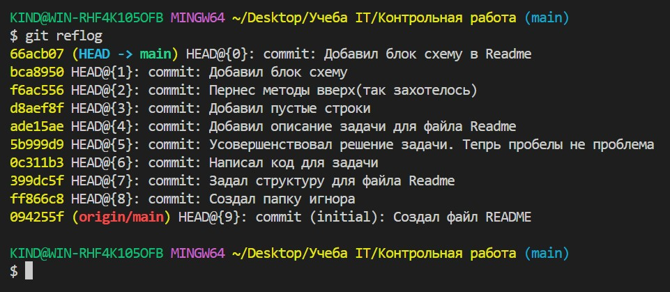

# __Итоговая контрольная работа по основному блоку__

**Задача:**<br/> 
```
Написать программу, которая из имеющегося массива строк формирует новый массив из строк, длина которых меньше, либо равна 3 символам. Первоначальный массив можно ввести с клавиатуры, либо задать на старте выполнения алгоритма. При решении не рекомендуется пользоваться коллекциями, лучше обойтись исключительно массивами.
```

**Примеры:**<br/> 
[“Hello”, “2”, “world”, “:-)”] → [“2”, “:-)”]<br/>
[“1234”, “1567”, “-2”, “computer science”] → [“-2”]<br/>
[“Russia”, “Denmark”, “Kazan”] → []<br/>


## Создать репозиторий на GitHub.
### __Инструкция для чайников__
1. Перейти на официальный сайт https://github.com/
2. Зарегистрироваться.
3. Создать новый репозиторий.
4. Итог: https://github.com/NikitaPavloB/FinalWorkGb.git

## *Нарисовать блок-схему алгоритма.*



## Снабдить репозиторий оформленным текстовым описанием решения.

Данная программа фильтрует массив строк, введенных пользователем, и выводит новый массив, содержащий только те элементы, длина которых не превышает 3 символов.

Сначала программа запрашивает количество строк, которые пользователь хочет ввести, и создает массив нужного размера. Затем происходит заполнение этого массива строками, которые вводятся пользователем с помощью цикла for.

Далее вызывается функция FilterArray, которая принимает на вход исходный массив строк и возвращает новый массив, содержащий только те элементы, длина которых не превышает 3 символов. Функция сначала подсчитывает количество элементов в новом массиве с помощью цикла for, затем создает новый массив нужного размера и заполняет его нужными элементами с помощью еще одного цикла for.

В конце программа выводит на экран исходный массив и новый отфильтрованный массив с помощью функции PrintArray, которая принимает на вход массив строк и выводит его на экран в квадратных скобках, разделяя элементы запятыми.

## Написать программу, решающую поставленную задачу.

Готовая программа находится в папке SolutionCode

## Использовать контроль версий в работе над этим небольшим проектом


